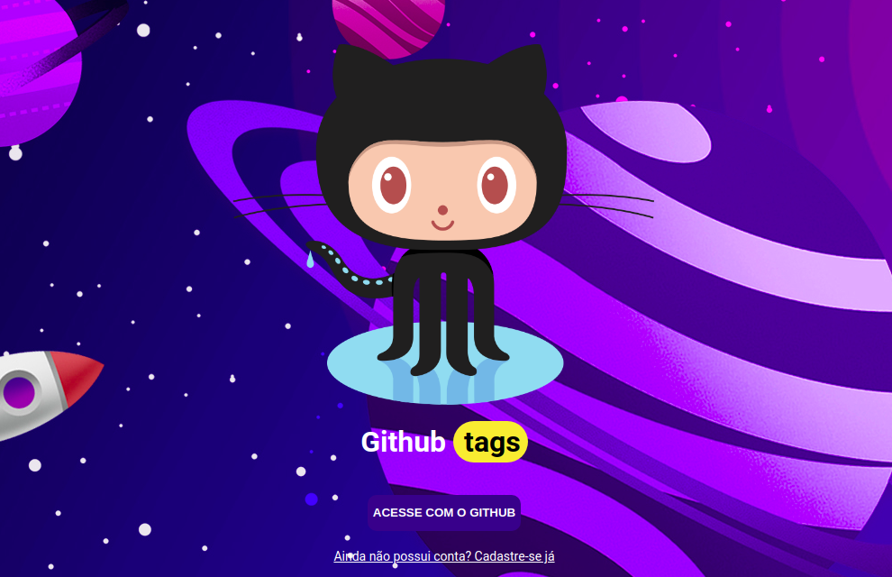
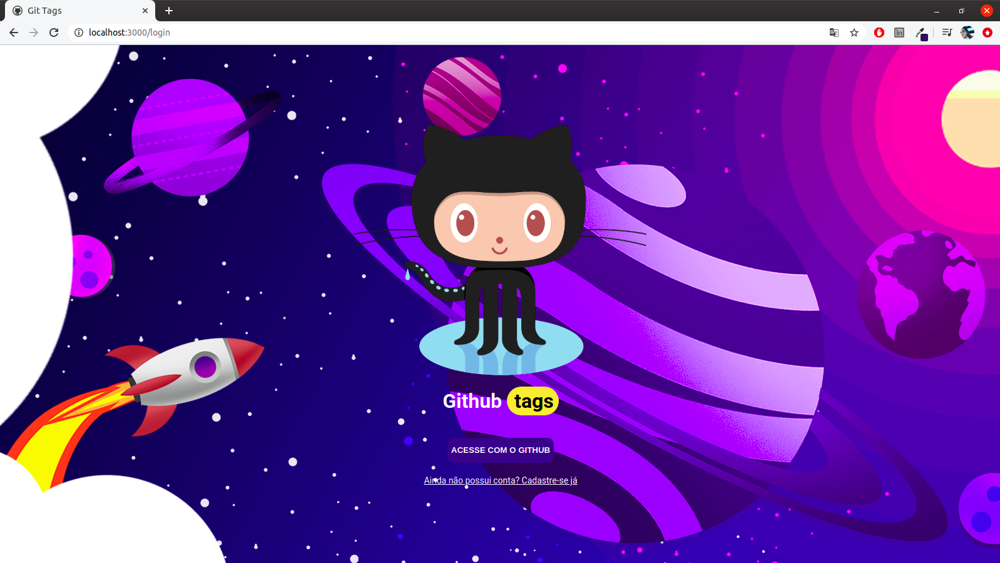
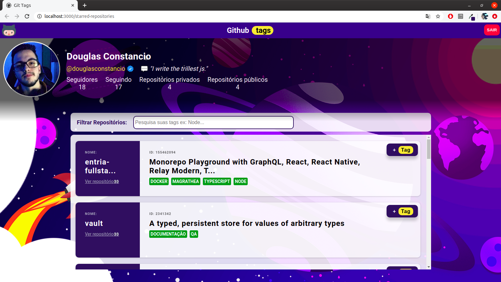
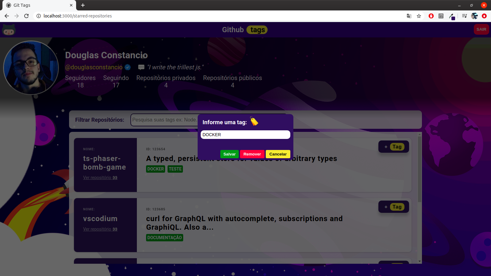
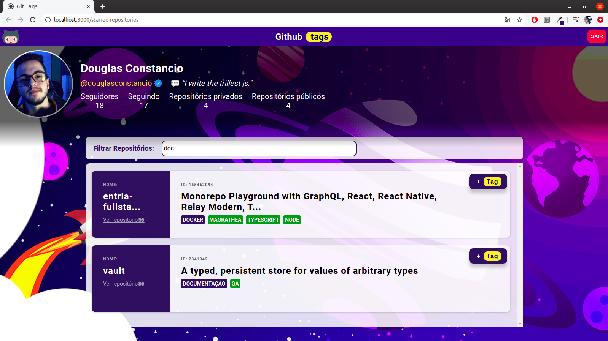
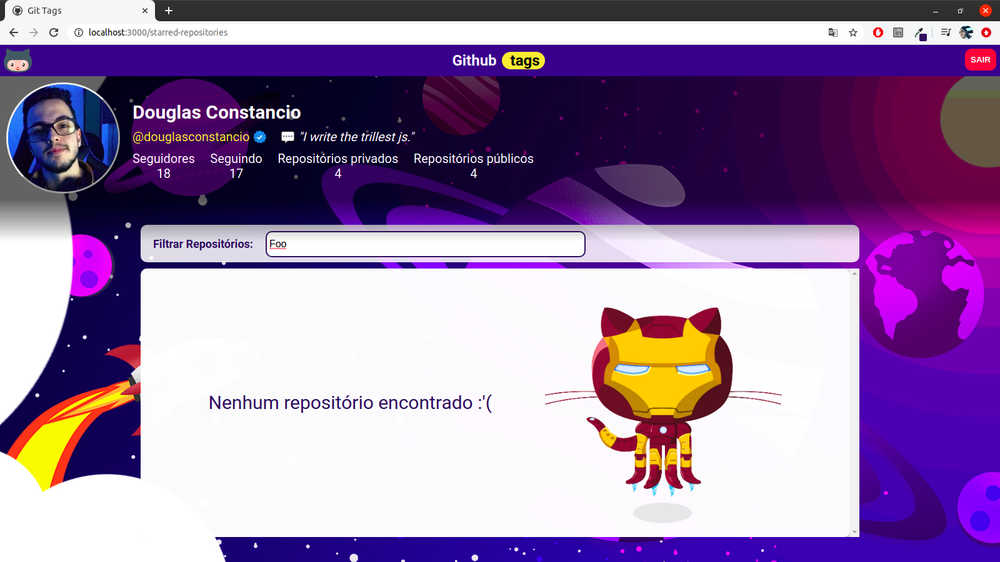

<h1 align="center" >GitTags - Frontend 👨🏻‍💻</h1>



<br/>

<p align="center">
    <a href="#-projeto">Projeto</a>&nbsp;&nbsp;&nbsp;|&nbsp;&nbsp;&nbsp;
    <a href="#-tecnologias">Tecnologias</a>&nbsp;&nbsp;&nbsp;|&nbsp;&nbsp;&nbsp;
    <a href="#-material-de-apoio">Material de apoio</a>&nbsp;&nbsp;&nbsp;|&nbsp;&nbsp;&nbsp;
    <a href="#-apresentação-visual">Apresentação visual</a>&nbsp;&nbsp;&nbsp;|&nbsp;&nbsp;&nbsp;
    <a href="#-como-baixar">Como baixar</a>&nbsp;&nbsp;&nbsp;|&nbsp;&nbsp;&nbsp;
    <a href="#-configurações-de-autenticação">Configurações</a>&nbsp;&nbsp;&nbsp;|&nbsp;&nbsp;&nbsp;
    <a href="#-melhorias">Melhorias</a>&nbsp;&nbsp;&nbsp;|&nbsp;&nbsp;&nbsp;
    <a href="#-sobre"> Sobre </a>&nbsp;&nbsp;&nbsp;|&nbsp;&nbsp;&nbsp;
    <a href="#-agradecimentos">Agradecimentos</a>

---

## 💻 Projeto

<p align="justify">
    O GitTags, é pra aquele que está sempre procurando novos projetos e curtindo aqueles que são interessantes. E gostaria de poder adicionar uma tag a um repositório para que ele possa ser encontrado facilmente. Por exemplo: encontrei um repositório chamado react e gostaria de adicionar tags <span style="background-color:purple"> typescript</span> e <span style="background-color:purple"> frontend</span>. Como o GitHub não possui essa funcionalidade, este sistema de forma simples pode ajudar nessa tarefa. <strong>A ideia é ir incrementando sempre um pouco mais </strong> 😏
</p>

---

## 📌 Tecnologias

<p align="justify">
Abaixo estão algumas das tecnologias utilizadas durante o desenvolvimento do projeto. Ainda foi visado: Organizar o diretório da nossa aplicação de forma concisa, limpa e eficiente. Escrever código limpo visando reutilização e eficiência e criar testes unitários e de integração.
</p>
<br>
<p align="center">
    
    
    
    
    
    
    
    
</p>

---

## 🗂 Material de apoio

- [Typescript](https://www.typescriptlang.org/)
- [API GitHub](https://docs.github.com/pt/rest/guides/getting-started-with-the-rest-api)
- [OAuth-io](https://oauth.io/signin)
- [OAuthJS](https://github.com/oauth-io/oauth-js)
- [CreateReactApp](https://create-react-app.dev/docs/getting-started/)
- [LoginWithGitHub](https://levelup.gitconnected.com/how-to-implement-login-with-github-in-a-react-app-bd3d704c64fc)

---

## 📊 Apresentação visual:

Bom, por toda ideia de Magrathea, espaço, mochileiro das galáxias... busquei uma tema em "homenagem" 😅 rs

### 🖥️ Tela de login:



### 🖥️ Tela de Repositórios favoritados:



### 🖥️ Modal de Criação/ Alteração/ Remoção de _Tags_:



### 🖥️ Pesquisa de _Tags_ (as que deu "_match_" ficam em destaque roxo):



### 🖥️ Pesquisa de _Tags_ (sem registros encontrados):



---

## ⬇️ Como baixar

```bash
    // Clonar repositório
    $ git clone https://github.com/douglasconstancio/frontend-git-tag.git

    // Acessar diretório
    $ cd frontend-git-tag

    // Instalar dependências
    $ yarn

    // Iniciar projeto
    $ yarn start

```

---

## 🔧 Configurações de autenticação

Inicialmente para este autenticação na aplicação, foi realizado a utilização do Github OAuthApps. Com ele iremos gerar credenciais, onde podemos fazer o _login_ com Github na nossa aplicação.

No própria tela do Github, em: ' `Settings > Developer settings > OAuth Apps > New OAuth App` '

Exemplo de parametrização para uso:

|    |
| ---|
| application-name: `nome-do-repositório`             |
| homepage: `https://oauth.io`                        |
| authorization callback URL: `https://oauth.io/auth` |

Com essas inforamações, será criado o **`client_id`** e **`cliente_secret`**

Entrar no [oAuth](https://oauth.io/signup) e fazer _login_ com o **Github**


Verificar as infomações do **App keys**

Adicionar a infomação '`localhost`' em **Domain's & URLs**

Em: ' `Integrated API's > +Add API's` ' selecionar o **Github**

Em: ' `Key's and permission scope` ' informar os dados:

|    |
| ---|
| client_id: `gerado pelo Github no OAuth Apps` |
| client_secret: `gerado pelo Github no OAuth Apps`|
| scope: `user` |

No diretório da raiz do projeto criar um arquivo `.env` com os seguintes dados:

```bash
REACT_APP_CLIENT_ID='client_id do OAuthApps'
REACT_APP_CLIENT_SECRET='client_secret do OAuthApps'
REACT_APP_REDIRECT_URI='http://localhost:3000/login'
REACT_APP_API_DB='http://localhost:4000'
REACT_APP_OAUTH_IO='public_key do oAuth-io'
```

O repositório do backend ta [aqui](https://github.com/douglasconstancio/backend-tags) 🎯

---

## 💭 Melhorias

- Tornar o site responsivo;
- Melhoras as tipagens (_type safe_);
- Levar a autenticação via API do Github para o _backend_;
- Melhorar as rotas (Criar uma rota específica para os repositórios e outra para as _tags_);

---

## 🔖 Sobre

<p align="justify">
Esse projeto foi desenvolvido com base na <a href="https://github.com/magrathealabs/template-projeto-selecao/blob/master/projects/GITHUB.md"> proposta</a> de projeto da MagratheaLabs.

</p>

---

## 👏🏼 Agradecimentos

<p align="justify">
Obrigado a todos que tiraram um tempinho pra ajudar a tirar uma dúvida, estenderem o tempo de dev, e pelos incentivos e elogios no Slack.
</p>
